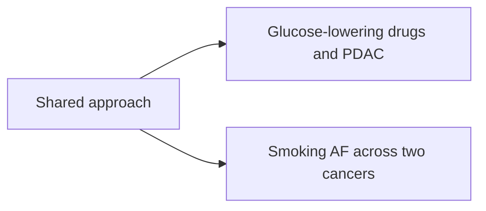

The shared method, the slate's rationale, and the open field questions. Per-paper
design and decisions live in each paper note; searches live in `research-log/`.
Cite with `[@citekey]`, never prose author-year.

## The slate

| # | Paper | Status | Note |
|---|---|---|---|
| 1 | Glucose-lowering drugs and PDAC | gated | [[glucose-drugs]] |
| 2 | Two-cancer smoking attributable fraction | GO | [[smoking-af]] |

The index-event bias argument is [@dahabreh2011index]; the smoking-cessation
evidence is [@furberg2022cessation] and [@kiebach2025smoking]. The attributable
fraction follows [@brown2018preventable; @garciaclosas2005nat2].

The current state is consolidated in
[[2026-07-06-portfolio-state-snapshot|portfolio-state-snapshot]], and the
schematic is ![[slate-diagram.png]].

Fasting insulin is itself a PDAC cause [@carrerastorres2017mr]. A pre-registration
sits at 10.1101/2023.04.20.23288770 and the method note at
<https://doi.org/10.1073/pnas.2408715121>.

Host contact for the EPIC stay is a.researcher@example-institute.org; the DKFZ
side is handled separately. #project/postdoc-cnio

Decision recorded 2026-07-13. ^slate-decision
